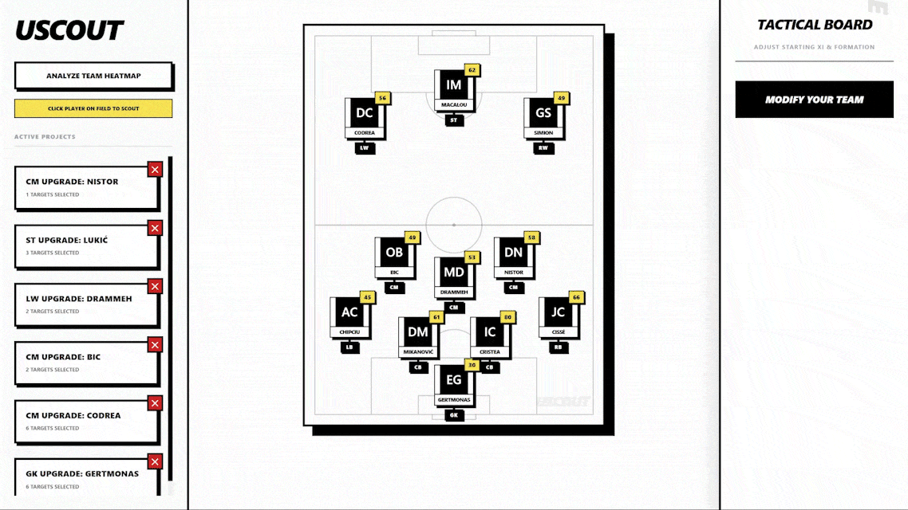
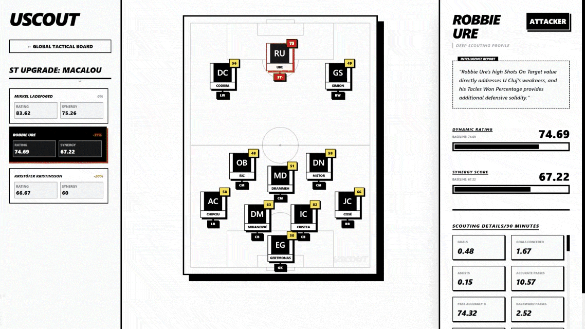
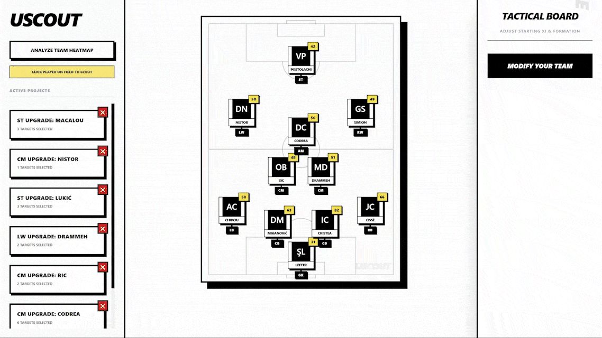
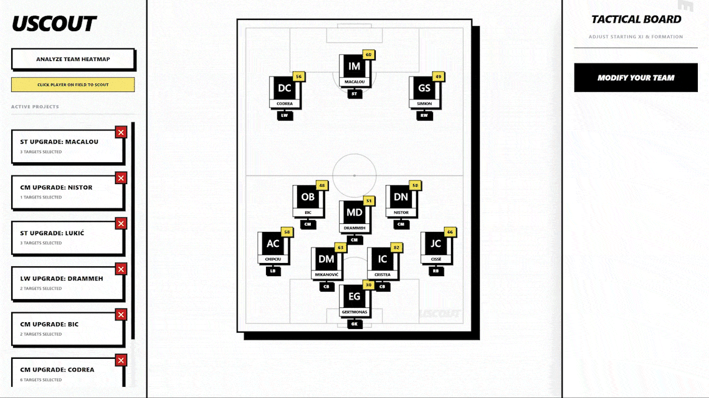

# ⚽ UScout: FC Universitatea Cluj AI Scouting Assistant

## Description
UScout is an advanced, AI-driven football scouting and data analysis platform designed specifically for FC Universitatea Cluj. By leveraging multi-agent LLM systems and real-time match data, it analyzes team performance, identifies squad deficits, and evaluates prospective players to find the perfect synergistic fit for the team. The project features a powerful Python-based AI backend and a lightning-fast React frontend dashboard.

## Try it here --> https://uscout-db.web.app/  

## Key Features Showcase

### 🗺️ Team Heatmap Analysis
Activate the **Heatmap** to instantly visualize the squad's positional deficits. The system assigns color-coded urgency scores (Low, Med, High) to each position based on recent match performance, helping managers immediately identify weak links that need reinforcement.


### ⚡ Live Synergy & Dynamic Rating Updates
Watch player ratings update in real-time as new data flows into the system. The **Dynamic Rating** calculates a baseline performance index modified by recent news/injuries, while the **Synergy Score** dynamically adjusts based on how well the prospect's specific stats address the current squad deficits.


### 📰 AI Intelligence Reports
Select any scouted prospect to view their deep profile. Our CrewAI "Sentinel" and "Matchmaker" agents generate a qualitative **Intelligence Report**, analyzing news, manager quotes, and tactical fit, providing a clear text summary of why a player is (or isn't) recommended.


### 📋 Tactical Board & Formation Modification
Enter **Manager Mode** to modify your starting XI and experiment with different formations (e.g., 4-2-3-1, 4-3-3, 4-4-2). The board automatically maps your current roster to the selected tactical blueprint, letting you swap out underperforming players with available substitutes.


### 🎯 Targeted Prospect Search
Click on any underperforming player on the tactical board to initiate a targeted scout search. The system simulates a search against a database of thousands of players, filtering for the specific role and sorting the top 10 prospects by their computed Synergy Score.


## Technologies Used
* **Frontend:** React 19, Vite, Tailwind CSS v4, Firebase
* **Backend & AI:** Python, CrewAI, Groq API (Llama 3/4 models)
* **Data Storage:** Firebase Firestore

## Installation

### Prerequisites
* Node.js (v18+)
* Python 3.10+
* Groq API Key
* Firebase Service Account Credentials

### Setup Steps

1. **Clone the repository**
   ```bash
   git clone https://github.com/yourusername/uscout.git
   cd uscout
   ```

2. **Frontend Setup**
   ```bash
   cd u-cluj-shadow
   npm install
   ```

3. **Backend Setup**
   ```bash
   cd ../Data_analysis
   python -m venv venv
   source venv/bin/activate  # On Windows use `venv\Scripts\activate`
   pip install -r requirements.txt
   ```

## Usage

**Running the Frontend Dashboard:**
```bash
cd u-cluj-shadow
npm run dev
```

**Running the AI Scouting Agents:**
```bash
cd Data_analysis
python crew_scouting.py
```

## Project Structure
```text
uscout/
├── Data_analysis/          # Python backend, CrewAI agents, and data scripts
│   └── crew_scouting.py    # Main multi-agent AI script
├── u-cluj-shadow/          # React Vite frontend application
│   ├── src/                # Frontend source code
│   └── package.json        # Frontend dependencies
├── firebase_cred.json      # Firebase private credentials (ignored in git)
└── .env                    # Environment variables (ignored in git)
```

## Configuration
To run this project securely, you need to configure your environment variables. 
1. Create a `.env` file in the root directory:
   ```env
   GROQ_API_KEY=your_groq_api_key_here
   ```
2. Place your `firebase_cred.json` in the root folder for database authentication. **Do not commit these files to version control.**

## Contributing
Contributions are welcome! Please follow these steps:
1. Fork the repository.
2. Create a new branch (`git checkout -b feature/amazing-feature`).
3. Commit your changes (`git commit -m 'Add some amazing feature'`).
4. Push to the branch (`git push origin feature/amazing-feature`).
5. Open a Pull Request.

## License
This project is licensed under the MIT License - see the LICENSE file for details.

## Contact / Author
**Author:** Robert
**GitHub:** Your GitHub Profile
